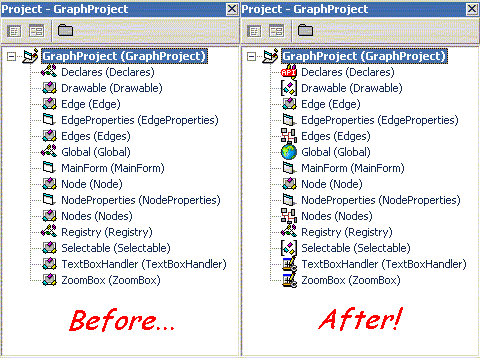



## Customize the icons in the VB Project Explorer Tree

### Description

Purpose: 

Allows customization of the icons displayed in the VB Project Explorer window. 

Icons can be customized on a global level (eg all form icons) or on an individual per-component level. 

I personally use it for visually separating collection classes, interfaces and normal classes. 

It allows 32-bit colour icons to be used, as opposed to VB's standard 16-colour ones.
 
### More Info
 
Known issues: 

* Because the addin uses windows messages involving pointers, it must execute from within the VB process. This means it will only work in compiled mode, you can't run it from the IDE. 

* Changing the view in the VB project explorer from foldered to nonfoldered causes a complete refresh of the tree, and customized icons are lost until the project is reloaded.

             |
---                |---
**Submitted On**   |2003-03-11 16:38:08
**By**             |[grigri](https://github.com/Planet-Source-Code/PSCIndex/blob/master/ByAuthor/grigri.md)
**Level**          |Advanced
**User Rating**    |5.0 (55 globes from 11 users)
**Compatibility**  |VB 6\.0
**Category**       |[Complete Applications](https://github.com/Planet-Source-Code/PSCIndex/blob/master/ByCategory/complete-applications__1-27.md)
**World**          |[Visual Basic](https://github.com/Planet-Source-Code/PSCIndex/blob/master/ByWorld/visual-basic.md)
**Archive File**   |[Customize\_1558253122003\.zip](https://github.com/Planet-Source-Code/grigri-customize-the-icons-in-the-vb-project-explorer-tree__1-43942/archive/master.zip)

